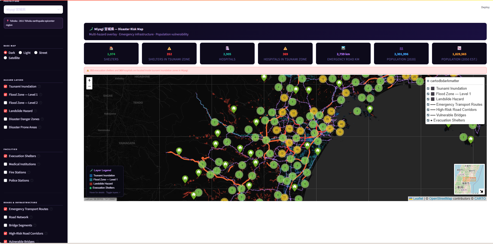

# 🗾 Japan Disaster Risk GIS Portal
### 防災リスク GIS ポータル

A production-grade multi-prefecture disaster risk GIS portal for Japan, integrating MLIT national land data, OpenStreetMap road networks, and graph-theoretic network analysis into an interactive Leaflet map served via a PostGIS spatial database.

## 📸 Screenshots

> Miyagi Prefecture fully loaded · 9 additional prefectures configured

## 🌐 Live Demo
**[https://www.japan-disaster-risk-gis-portal.com](https://www.japan-disaster-risk-gis-portal.com)**
Hosted on AWS EC2 ap-northeast-1 (Tokyo) · SSL/HTTPS · Nginx reverse proxy

## 🏗️ Architecture

```
MLIT Shapefiles ──┐
                  ├──→ ETL Pipeline (GeoPandas) ──→ PostGIS ──→ Streamlit + Folium ──→ Browser
OSM via osmnx ────┘              ↓                      ↓
                          networkx graph          pg_tileserv
                          analysis               (vector tiles)
```

**Data flow:**
1. MLIT shapefiles ingested via `load_mlit.py` → PostGIS spatial tables
2. OSM road network downloaded city-by-city via `load_osm.py` → PostGIS roads table
3. Graph analysis via `fast_write_scores.py` → betweenness + bridge risk scores written back
4. Streamlit queries PostGIS → Folium renders interactive Leaflet map
5. pg_tileserv serves vector tiles directly from PostGIS views

## 📊 Data

| Layer | Source | Records |
|---|---|---|
| Tsunami inundation zones | MLIT A40 | 204,101 polygons |
| Flood zones (Level 1 + 2) | MLIT A31a | 100,706 polygons |
| Landslide hazard zones | MLIT A33 | 24,723 polygons |
| Disaster danger zones | MLIT A47/A48 | 479 polygons |
| Evacuation shelters | MLIT P20 | 1,974 points |
| Medical institutions | MLIT P04 | 2,905 points |
| Fire + police stations | MLIT P17/P18 | 371 points |
| OSM road network | OpenStreetMap | 354,749 segments |
| Emergency transport routes | MLIT N10 | 1,212 segments |
| Population mesh 2020–2050 | MLIT 500m grid | 25,586 cells |

## 🔍 Analysis

- **Graph analysis** — Edge betweenness centrality on 339,485 road segments (networkx)
- **High-Risk Road Corridors** — Top 10% roads by network criticality
- **Vulnerable Bridges** — 8,716 bridges ranked by combined risk score
- **Shelter vulnerability** — 352 evacuation shelters inside tsunami inundation zones
- **Hospital vulnerability** — 369 hospitals inside tsunami inundation zones
- **Shelter accessibility** — Multi-source Dijkstra across full Miyagi road network

## 🛠️ Stack

| Component | Technology |
|---|---|
| Database | PostgreSQL 16 + PostGIS 3.4 |
| Tile server | pg_tileserv |
| Frontend | Streamlit + Folium/Leaflet |
| Graph analysis | networkx + osmnx |
| Spatial data | GeoPandas + SQLAlchemy |
| Containerization | Docker + Docker Compose |
| Deployment | AWS EC2 (t3.medium, Ubuntu 22.04) |

## 🚀 Setup

### Prerequisites
- Docker Desktop
- Python 3.13+
- uv

### 1. Clone and configure
```bash
git clone https://github.com/IpshitaPPradhan/japan-gis-portal.git
cd japan-gis-portal
cp .env.example .env
# Edit .env with your database credentials
```

### 2. Start services
```bash
docker compose up -d
```

### 3. Download MLIT data
Download Miyagi prefecture datasets from [MLIT KSJ](https://nlftp.mlit.go.jp/ksj/) into `data/miyagi/`:
- A40 (tsunami), A31a (flood), A33 (landslide), A47/A48 (danger zones)
- P20 (shelters), P04 (medical), P17 (fire), P18 (police), N10 (emergency roads)
- 500m population mesh

### 4. Run ingestion pipeline
```bash
uv venv && .venv\Scripts\activate
uv pip install -r requirements.txt

python ingestion/load_mlit.py      # Load MLIT shapefiles
python ingestion/load_osm.py       # Download OSM road network
python ingestion/fast_write_scores.py  # Graph analysis
```

### 5. Run app
```bash
streamlit run app.py
```

Open `http://localhost:8501`

## 📁 Project Structure

```
japan-gis-portal/
├── app.py                         # Streamlit entry point
├── config.py                      # Layer definitions and app config
├── docker-compose.yml             # PostGIS, Streamlit, pg_tileserv, pgAdmin
├── Dockerfile
├── requirements.txt
├── ingestion/
│   ├── load_mlit.py               # MLIT shapefile ingestion (ETL)
│   ├── load_osm.py                # OSM road network city-by-city download
│   └── fast_write_scores.py       # Graph analysis + bulk PostGIS write
├── modules/
│   ├── db.py                      # All spatial queries (PostGIS)
│   └── map_builder.py             # Folium map construction
└── sql/
    ├── 01_schema.sql              # PostGIS tables, indexes, prefecture seed
    └── 02_tile_views.sql          # pg_tileserv optimized views
```

## 📋 Data Sources

- [MLIT 国土数値情報](https://nlftp.mlit.go.jp/ksj/) — CC-BY 4.0
- [OpenStreetMap](https://www.openstreetmap.org/) — ODbL
- [500m Population Mesh](https://nlftp.mlit.go.jp/ksj/) — MLIT 2024

## 🎯 Relevance

This project directly addresses Japan's disaster resilience planning framework used by MLIT, AIST, and NTT R&D. The graph analysis methodology identifies critical infrastructure vulnerabilities consistent with post-2011 Tōhoku earthquake resilience research.

